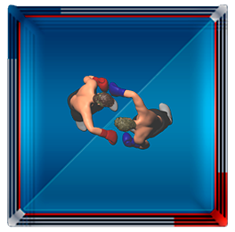

# Test task for a web developer

В папке source находится набор картинок, которые представляют собой кадры спрайтовых анимаций серии боксерских ударов для двух боксеров: красного и синего.

Ваша задача: с использованием js-фреймворка [PixiJs](https://www.pixijs.com/) или любого другого аналогичного, а так же с помощью любого бэкэнда с поддержкой [Socket.IO](https://socket.io/), сделать "симулятор" боксерского поединка.

Клиент, с использованием протокола socket.io, подключается к серверу, сервер начинает с определенной периодичностью (например, раз в секунду) передавать на клиент каманды: какой боксер (красный или синий) какой удар должны воспроизвести. После получения команды клиент проигрывает соответствующую анимацию.

Список ударов:
- L_Jabb_Head
- R_Jabb_Head
- L_Hook_Head
- R_Hook_Head
- L_Hook_Body
- R_Hook_Body
- L_Ucut_Head
- R_Ucut_Head
- L_Ucut_Body
- R_Ucut_Body
- L_Ovhd_Head
- R_Ovhd_Head
- block

Между ударами проигрывается анимация idle. Удары генерирует сервер в произвольном порядке для любого боксера.

Двигаться по рингу боксеры не должны, они стоят друг напротив друга, как показано на рисунке 

Раунд - период времени, когда боксеры спаррингуются - длится 3 мин., в поединке 4 раунда с перерывом после каждого раунда 10 сек. в течении которых боксеры сидят по углам ринга с ссответствующей анимацией.

По нашей оценке на решение данной задачи можно потратить от 2 до 8 часов, в зависимости от степени владения выбранным js-фреймворком для анимации. Решение должно быть представлено в виде ссылки на репозиторий на GitHub-е.
